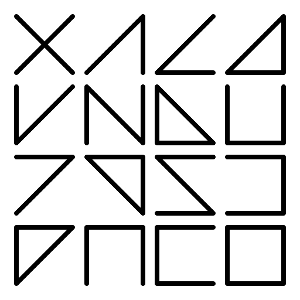
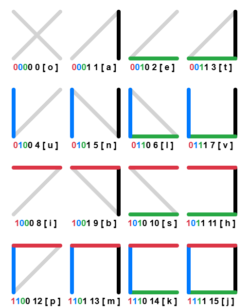
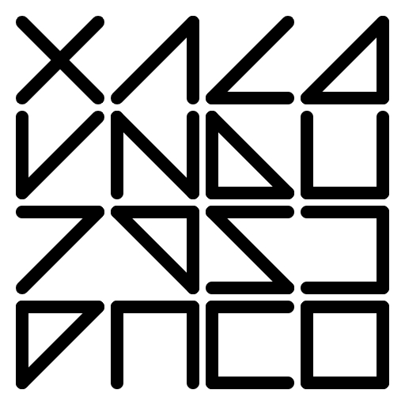
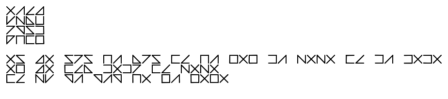

# 🟦 YOalphabet 4-Bit Isomorphic Script & Logical YOconlang

> **"A self-balancing 4-bit isomorphic YOalphabet encoding and logical YOconlang designed for human-machine, human-human communication"**

  

## 💎 Thank you for your support the YOalphabet&YOvonlang development via cryptocurrency. 

* **USDT (Network: TRON / TRC-20):** 
  `TFwggRZUB9BBNHwyXgZBGkd2EycSz9umGJ`

* **USDT / USDC / ETH (Network: Ethereum / ERC-20):** 
  `0x1102BbE0c8aeF5D2e44059fb951671CfC2047255`

* **TON / NOT / DOGS (Network: TON):** 
  `UQAaXGP24eJgyfbdLC2j5R5lOicvSSPo8PGJIEnJvxjQxAsc`

The **YOalphabet** introduces a completely synthesized, a priori communication environment. Every single character (glyph) in this system is a strict, one-to-one isomorphic fusion of four distinct domains:`Binary Code (4-bit) ── Decimal Index (0-15) ── IPA Acoustic Sound ── Rigid Geometry`
By positioning itself precisely between human cognitive perception and computational logic, it slashes data bandwidth by up to 90%, enabling robust communication over extreme, low-power, or degraded channels.

## 🧠 Dual-Layer Architecture: For Humans & Machines

Unlike historical logical languages that force the human brain to calculate data like a computer chip during live speech, YOecosystem features a unique **dual-layer interface**:
1. **The Human Layer (UX):** For regular communication, it functions as an ultra-regular, exception-free language with fixed first-syllable stress. Humans instantly recognize glyphs via intuitive, built-in visual metaphors.
2. **The Machine Layer (Dev):** For computers, routers, or AI, every word automatically decomposes into raw 4-bit hardware registers  without the need for resource-heavy text-to-vector embeddings.

## PART 1: YOalphabet Script Specification

YOalphabet is a fully determined, generative writing system based on a 4-bit full isomorphism. Every glyph represents an unbreakable, one-to-one correspondence between a geometric symbol, a unique International Phonetic Alphabet (IPA) sound, a decimal number (0–15), and a 4-bit binary code.

  

Each character is inscribed within an invariant square bounding box consisting of two independent structural layers:

1. **Outer Contour (Bit Registers):** The four external edges of the square act as physical data registers. They are activated strictly clockwise, starting from the right vertical line:
   * Bit 0 (weight 1 = 2⁰): Right vertical line `[ |]`
   * Bit 1 (weight 2 = 2¹): Bottom horizontal line `[_]`
   * Bit 2 (weight 4 = 2²): Left vertical line `[| ]`
   * Bit 3 (weight 8 = 2³): Top horizontal line `[¯]`
   * *Rule:* If a bit is "1", the line is drawn; if "0", it remains empty.

2. **Internal Filling (Visual Balance Diagonals):** Internal diagonals are used to balance the stroke density and optimize optical readability:
   * **Low Density (0–1 active bits):** Balanced by internal lines up to a fixed density of 2 lines. Absolute zero (`0000`) has no outer contour and is balanced by a full internal cross `[X]`.
   * **Medium Density (2 active bits):** Supplemented by exactly one internal diagonal (`/` or `\`) to reach a fixed density of 3 lines.
   * **High Density (3–4 active bits):** Completely inner-empty, retaining their natural outer density of 3 or 4 lines.
     
* Dec: 0 | Bin: 0000 | Contour: None | Internal: X | IPA: [o]
* Dec: 1 | Bin: 0001 | Contour: Right | Internal: / | IPA: [a]
* Dec: 2 | Bin: 0010 | Contour: Bottom | Internal: / | IPA: [e]
* Dec: 3 | Bin: 0011 | Contour: Bottom + Right | Internal: / | IPA: [t]
* Dec: 4 | Bin: 0100 | Contour: Left | Internal: / | IPA: [u]
* Dec: 5 | Bin: 0101 | Contour: Left + Right | Internal: \ | IPA: [n]
* Dec: 6 | Bin: 0110 | Contour: Left + Bottom | Internal: \ | IPA: [l]
* Dec: 7 | Bin: 0111 | Contour: Left + Bottom + Right | Internal: None | IPA: [v]
* Dec: 8 | Bin: 1000 | Contour: Top | Internal: / | IPA: [i]
* Dec: 9 | Bin: 1001 | Contour: Top + Right | Internal: \ | IPA: [b]
* Dec: 10 | Bin: 1010 | Contour: Top + Bottom | Internal: \ | IPA: [s]
* Dec: 11 | Bin: 1011 | Contour: Top + Bottom + Right | Internal: None | IPA: [h]
* Dec: 12 | Bin: 1100 | Contour: Top + Left | Internal: / | IPA: [p]
* Dec: 13 | Bin: 1101 | Contour: Top + Left + Right | Internal: None | IPA: [m]
* Dec: 14 | Bin: 1110 | Contour: Top + Left + Bottom | Internal: None | IPA: [k]
* Dec: 15 | Bin: 1111 | Contour: Top + Left + Bottom + Right | Internal: None | IPA: [j]
----------------------------------------------------------------------------

## The 4x4 Identity YOalphabet Matrix (The Script Passport)
On physical and digital media, the complete code table is strictly displayed as a monolithic 4x4 matrix, filling sequentially from left to right, top to bottom by increasing decimal index. This matrix serves as the identification and calibration passport of the system. Also, this image can be used to promote the YOalphabet.

  

---------------------------------------------------------------------------
## PART 2: YOconlang CORE SPECIFICATION## Core Architecture and Word Immutability
YOconlang is an a priori engineered language optimized for unambiguous, frictionless communication. A foundational axiom of the language is the absolute immutability of roots. There are no inflections, suffixes, declensions, or internal conjugations. Grammatical categories, temporal shifts, and modalities are expressed exclusively via external grammatical particles.
The phonotactics are strictly anchored in the International Phonetic Alphabet (IPA), using 5 core vowels and 11 stable consonants to eliminate all articulatory barriers. Stress is fixed invariantly on the first syllable of every separate word.
The language utilizes strict morphological word templates:

* Verbs, Adjectives, Adverbs: Rigid three-letter roots following the C₁VC₂ structure.
* Nouns: Rigid four-letter roots following the C₁V₁C₂V₂ structure.
* Pronouns and Structural Particles: Two-letter combinations following VC or CV templates.

## Strict SVO Word Order and Linear Syntax
The language enforces a rigid, unalterable linear SVO (Subject — Verb — Object) word order. Any form of inversion, omission, or displacement of components is strictly forbidden. 
Since the core roots are completely uninflected, grammatical and syntactic roles are determined solely by their fixed geometric position within the sentence flow.

## The Semantic Core Matrix (The YOconlang Kernel)
All lexical meanings and roots are generated systematically through a 3-axis orthogonal matrix based on the Core Kernel.
## Axis 1: C₁ — Domain of Origin (Source Environment)

* L — Space / Physical Geometry: Coordinates, three-dimensional volume, distance, location.
* T — Time / Chronology: Chronological scale, duration of processes, phases, natural cycles.
* P — Inanimate Matter: Substances, inorganic materials, artificial objects, tools.
* B — Energy and Forces: Physical phenomena, vectors, directional energy fields.
* S — Biosphere and Life: Organic carbon life, flora, fauna, tissues, cells, human physical body.
* N — Psyche and Will: Internal mental world, consciousness, emotions, intent, focus of attention.
* V — Primary Perception / Sensory: Raw incoming signals of sense organs before logical analysis.
* M — Language and Coding / Semiotics: Interfaces and means of transmitting meaning — signs, tokens, words, syntax.
* K — Data and Memory / Statics: Fixed archived information, datasets, blocks of knowledge, files.
* H — Thinking and Algorithms / Dynamics: Data processing, logical analysis, computations, runtime code.
* J — Social sphere: Family, communities, social hierarchies, institutions, economy, network graphs.

## Axis 2: V₁ — Process Vector (Operational Mode)

* O — Statics / Being: State of rest, parameter locking, preservation of status quo, immutability.
* A — Action / Modification: Active change, generation of a new quality, assembly, creation, work.
* U — Counteraction / Destruction: Quality degradation, entropy, structural breakdown, deletion.
* E — Import / Perception (Input): Inbound system flow, absorption of external environment, data reading.
* I — Export / Expression (Output): Outbound system flow, emission of energy, data writing, transmission.

## Axis 3: C₂ — Target Node of Impact (Objective Destination)
The C₂ consonant maps symmetrically to the exact type of destination entity or environment being impacted by the vector flow:

* L — Location / Point: Final spatial target, physical landmark, memory coordinate address.
* T — Term / Event: Fixed time interval, deadline, timestamp, chronological phase.
* P — Object / Instrument: Inanimate material thing, tool, raw physical substance.
* B — Element / Directed Force: Directional wave, physical impulse, pressure vector.
* S — Bio-object / Organism: Living individual, biological structure, human body node.
* N — Personality / Mental State: Individual consciousness, cognitive target, focus trigger, belief.
* V — Primary Sensation: Raw sensory stimulus, physical receptor excitation.
* M — Word / Concept: Explicit linguistic token, entity name, interface identifier, label.
* K — Message / Text: Connected block of information, letter, archived dataset, code line.
* H — Rule / Algorithm: Explicit code, legal or moral norm, regulation, mathematical calculation.
* J — Collective / Network Graph: Social group, community, structured network of human or system relations.
----------------------------------------------------------------------------------------------------------

  

   YOconlang Translation Specification: Universal Declaration of Human Rights (Article 1) 
    This section provides a complete, granular, word-by-word morphemic breakdown and phonetical transcription 
    of the First Article of the Universal Declaration of Human Rights translated into YOconlang. 
    The translation strictly adheres to the unchangeable root axiom, SVO linear syntax,
    and fixed first-syllable stress phonotactics.

## 📄 Sentence 1: On Birth, Freedom, and Equality of All Human Beings

* Original (American English): "All human beings are born free and equal in dignity and rights."
* YOconlang Orthography: OS TO SIS MA LIS KE MA JOJ HA NONO KE HA HOHO.
* IPA Phonetic Transcription: [ˈos ˈto ˈsis ˈma ˈlis ˈke ˈma ˈjoj ˈha ˈno.no ˈke ˈha ˈho.ho]

## 🔍 Word-by-Word Breakdown:

* OS — [os] : Universality pronoun from the approved Block O. Semantics: "All people / All human beings". Functions as the syntactic Subject (S).
* TO — [to] : Grammatical tense particle from Block T. Marks the past perfective tense (Preterite).
* SIS — [sis] : Immutable verbal root from Block 5 (Biosphere & Life). Core semantics: "To release new living organisms outward / To give birth / To reproduce" (Mode I — Outbound/Output Flow).
* MA — [ma] : Functional grammatical marker from Block 8 (Semiotics) that transforms the subsequent root into the Adjective class.
* LIS — [lis] : Immutable three-letter root from Block 1 (Space). Acts as an adjective due to the preceding MA marker. Core semantics: "To release a living organism outside / To liberate the physical body / To grant freedom" (Mode I — Outbound Flow). MA LIS translates directly to "free".
* KE — [ke] : Logical conjunction operator "AND" from Block 9 (Data & Memory).
* MA — [ma] : Repeated functional adjective marker preceding the second quality.
* JOJ — [joj] : Immutable three-letter root from Block 11 (Sociosphere) acting as an adjective. Core semantics: "To preserve an internal network of connections / To be identical to oneself / Equal in status" (Mode O — Statics/Parity). MA JOJ translates directly to "equal".
* HA — [ha] : Procedural operator particle meaning "Regarding / Concerning / In relation to" from Block 10 (Logic). Defines the semantic scope or plane where the qualities manifest.
* NONO — [ˈno.no] : Four-letter Noun structured as C₁V₁C₂V₂. Derived from the mental root NON (self-reflection, tranquility of mind, consciousness) and the final functional vowel O (Substance/Rest). Semantics: "Personal dignity / The inner mental 'Self' of a subject".
* KE — [ke] : Logical conjunction operator "AND".
* HA — [ha] : Repeated procedural operator particle "Regarding / In relation to".
* HOHO — [ˈho.ho] : Four-letter Noun structured as C₁V₁C₂V₂. Derived from the logical root HOH (to execute a pure algorithm) and the final functional vowel O (Substance). Semantics: "Abstract law / Legal right / Unalterable systemic norm".

------------------------------
## 📄 Sentence 2: On Endowment with Reason and Conscience

* Original (American English): "They are endowed with reason and conscience"
* YOconlang Orthography: OJ TO KEL HOHI KE NONO.
* IPA Phonetic Transcription: [ˈoj ˈto ˈkel ˈho.hi ˈke ˈno.no]

## 🔍 Word-by-Word Breakdown:

* OJ — [oj] : Collective universality pronoun from Block O. Semantics: "The entire society / They as a collective group / Human collective". Functions as the syntactic Subject (S) in the SVO structure.
* TO — [to] : Past tense particle (Preterite). Verifies the historical fact of being endowed.
* KEL — [kel] : Immutable verbal root from Block 9 (Data & Memory). Core semantics: "To receive external texts / To import data archives / To absorb and capture information at the circuit input" (Mode E — Import/Input). Syntactically maps to "to receive / to absorb / to be endowed with".
* HOHI — [ˈho.hi] : Four-letter Noun structured as C₁V₁C₂V₂. Derived from the root HOH (logic) and the final functional vowel I (Projection/Output). Semantics: "The processed outbound logical output of computations / Intellect / Reason". Functions as the primary direct Object (O₁).
* KE — [ke] : Logical conjunction operator "AND".
* NONO — [ˈno.no] : Four-letter Noun structured as C₁V₁C₂V₂ (Root NON + Vowel O). Semantics within this specific syntactic position: "Internal moral peace of mind / Moral self-awareness / Conscience". Functions as the secondary direct Object (O₂).

------------------------------
## 📄 Sentence 3: On the Obligation to Act in a Spirit of Brotherhood

* Original (American English): "and should act towards one another in a spirit of brotherhood."
* YOconlang Orthography: KE NU BA BAB MO JA JOJO.
* IPA Phonetic Transcription: [ˈke ˈnu ˈba ˈbab ˈmo ˈja ˈjo.jo]

## 🔍 Word-by-Word Breakdown:

* KE — [ke] : Logical conjunction operator "AND", initiating a new coordinate clause in the speech stream.
* NU — [nu] : Modal particle of absolute duty and rigid obligation from Block 6 (Psychology). Semantics: "Must / Should / Is obliged to" (modifies the subsequent action).
* BA — [ba] : Reciprocal voice particle from Block 4 (Energy & Forces). Directs the subsequent kinetic impulse of the verb symmetrically towards each participant ("mutually / towards one another").
* BAB — [bab] : Immutable verbal root from Block 4 (Energy & Forces). Core semantics: "To modify a physical or systemic impulse / To direct a stream of force / To act / To exert influence" (Mode A — Action). NU BA BAB translates directly to "are obliged to mutually act".
* MO — [mo] : Functional grammatical marker from Block 8 (Semiotics) that transforms the subsequent root into the Adverb class.
* JA — [ja] : Immutable three-letter root from Block 11 (Sociosphere) acting as an adverb due to the MO marker. Core semantics: "To direct an action for the benefit of the collective / solidarily" (Mode A — Social System Target). MO JA translates to "collectively / solidarily / in a spirit of cooperation".
* JOJO — [ˈjo.jo] : Four-letter Noun structured as C₁V₁C₂V₂. Derived from the root JOJ (preservation of an internal network of connections) and the final functional vowel O (Substance/Rest). Semantics: "An unbreakable, stable internal network of collective ties / Family / Community / Brotherhood".

------------------------------
## 🎼 Complete Monolithic Phonetic Stream
The complete unbroken stream of text is ready for phonetic compilation and synthesis:
[ˈos ˈto ˈsis ˈma ˈlis ˈke ˈma ˈjoj ˈha ˈno.no ˈke ˈha ˈho.ho ˈoj ˈto ˈkel ˈho.hi ˈke ˈno.no ˈke ˈnu ˈba ˈbab ˈmo ˈja ˈjo.jo]
## 🛠 Syntax & Phonotactic Compliance Notes:

   1. All word order arrays are strictly restricted to the linear SVO framework.
   2. Phonetic reduction or vowel slurring is completely absent (0%).
   3. Stress assignment is invariantly locked onto the first syllable of every single word unit.

----------------------------------------------------------------------------------------------------------------------------------------------------------------------------------------

### 🛠️ Practical High-Impact Applications

#### 🌐 1. Specialized Communication Channels & Low-Bandwidth Infrastructure
* **Subsea & Deep Space Sub-channels:** Ideal for Very Low Frequency (VLF) acoustic modems or long-range deep-space nodes where transmission is capped at single bits per minute.
* **Extreme Degraded Networks (LoRaWAN & Mesh):** Eliminates heavy string payloads. A single byte transmits two fully formed, phonetically rich semantic roots, bypassing the need for transport-layer text compression.
* **Emergency Quantum & Laser Dispersal:** The 4-bit binary matrix provides a zero-overhead error-correction baseline for Free-Space Optical (FSO) or post-quantum cryptographic telemetry.

#### 🧠 2. Human-Machine & Bio-Digital Interfaces (HCI / BCI)
* **Inclusive Human-Hardware (Assistive Tech):** The high-contrast, self-balancing grid enables tactical and tactile character recognition for the visually impaired that is vastly superior to complex, non-isomorphic Braille layouts.
* **Direct Neural Encoding (BCI / EEG):** The 4-bit register-level architecture mirrors discrete neural firing patterns, allowing brain-computer interfaces to read, parse, and synthesize text directly without resource-heavy NLP model translation.
* **Augmented Reality (AR) Heads-Up Displays:** Optimized for low-resolution, high-glare smart glasses. The strict geometric contours ensure instantaneous edge-detection rendering by low-power wearable chips.

#### 🔋 3. Data Green-Computing & Edge IoT Swarms
* **Hardware-Level Register Strings:** Direct execution on 8-bit or 16-bit microcontrollers within autonomous Machine-to-Machine (M2M) IoT swarms, fully bypassing application layers and reducing data center cooling and power footprints.
* **Energy-Harvesting Edge Devices:** Operates efficiently on passive RFID/NFC or solar-powered sensors, executing semantic logic at the bare hardware level before the power cycle depletes.

#### 🤖 4. Autonomous Systems & Resilient Infrastructure
* **Swarm Robotics & Kinetic Coordination:** Drone networks can exchange uncompressed, structural SVO command vectors (`Subject-Verb-Object`) in real-time using raw 4-bit physical registers for collision avoidance and target alignment.
* **Air-Gapped Industrial Automation:** Provides an isolated, predictable, human-readable yet machine-executable instruction script for SCADA systems, preventing buffer overflow exploits and remote code execution vulnerabilities.

---
**License:** MIT License. Fork, experiment, and build the future of unified computing communication!
