

[-Follow%20%40YOconlang-1DA1F2?style=for-the-badge&logo=x&logoColor=white)](https://x.com/YOalphabet)

# YOalphabet & YOconlang: 4-Bit Hardware-Isomorphic Script and Language.

> **"A self-balancing 4-bit isomorphic script and logical conlang engineered as a zero-ambiguity, MECE ontological interface for Human-AI symbiosis."**

  

  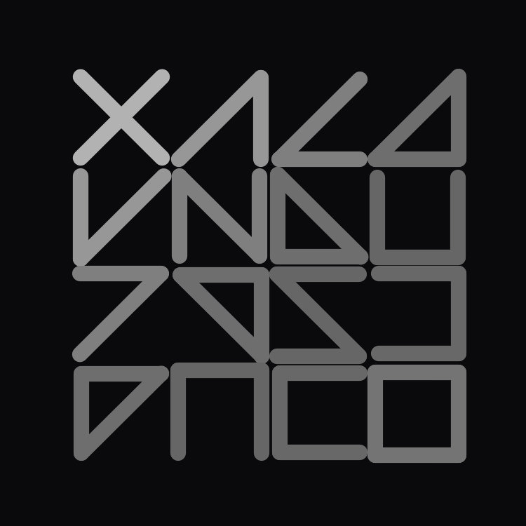
   
  <b>Figure:</b> Dynamic 4-bit wave visualization and isomorphic glyph transformations in YOalphabet.

> ⚡ **Zero-Inference 4-Bit Hardware Geometry & Hallucination-Free Logical Conlang**
> 
> * **Bypassing CNNs & Embeddings:** Direct 4-bit hardware register parsing without resource-heavy models or vector lookups.
> * **Engineered for Edge IoT, M2M & BCI:** Low-power execution and zero-latency physical register / neural mapping.
> * **0% LLM Hallucinations:** Immutable SVO syntax anchored in a 3-axis MECE semantic matrix.

The **YOalphabet** introduces a completely synthesized, a priori communication environment. Every single character (glyph) in this system is a strict, one-to-one isomorphic fusion of four distinct domains:`Binary Code (4-bit) ── Decimal Index (0-15) ── IPA Acoustic Sound ── Rigid Geometry`
By positioning itself precisely between human cognitive perception and computational logic, it slashes data bandwidth by up to 90%, enabling robust communication over extreme, low-power, or degraded channels.

## 🧠 Dual-Layer Architecture: For Humans & Machines

Unlike historical logical languages that force the human brain to calculate data like a computer chip during live speech, YOalphabet features a unique **dual-layer interface**:
1. **The Human Layer (UX):** For regular communication, it functions as an ultra-regular, exception-free language with fixed first-syllable stress. Humans instantly recognize glyphs via intuitive, built-in visual metaphors.
2. **The AI & Machine Layer (Dev):** For computers, routers, or AI, every word automatically decomposes into raw 4-bit hardware registers  without the need for resource-heavy text-to-vector embeddings.

---

## PART 1: YOalphabet Script Specification

YOalphabet is a fully determined, generative writing system based on a 4-bit full isomorphism. 
Every glyph represents an unbreakable, one-to-one correspondence between a geometric symbol, a unique International Phonetic Alphabet (IPA) sound, a decimal number (0–15), and a 4-bit binary code.

# **Binary Code ⟺ Decimal Index ⟺ Spatial Geometry ⟺ IPA Phoneme**

Each character is inscribed within an invariant square bounding box consisting of two independent structural layers:

---
1. **Outer Contour (Bit Registers):** The four external edges of the square act as physical data registers. Rule: If a bit is "1", the line is drawn; if "0", it remains empty. They are activated strictly clockwise, starting from the right vertical line:

  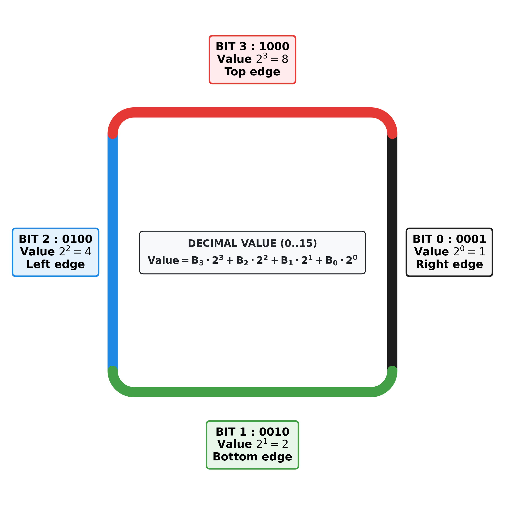
   
  <b>Figure 1:</b> Standard 4-bit positional register mapping, color-coded edge vectors, and decimal value calculation formula.

| Bit | Weight | Binary | Shape Element |
| :--- | :--- | :--- | :--- |
| **Bit 0** |  $2^0 = 1$ | `0001` | Right vertical line |
| **Bit 1** |  $2^1 = 2$ | `0010` | Bottom horizontal line |
| **Bit 2** |  $2^2 = 4$ | `0100` | Left vertical line |
| **Bit 3** |  $2^3 = 8$ | `1000` | Top horizontal line |

The integer decimal value of any glyph is calculated directly from its active edge bits:

$$
\text{Value} = B_3 \cdot 2^3 + B_2 \cdot 2^2 + B_1 \cdot 2^1 + B_0 \cdot 2^0
$$

  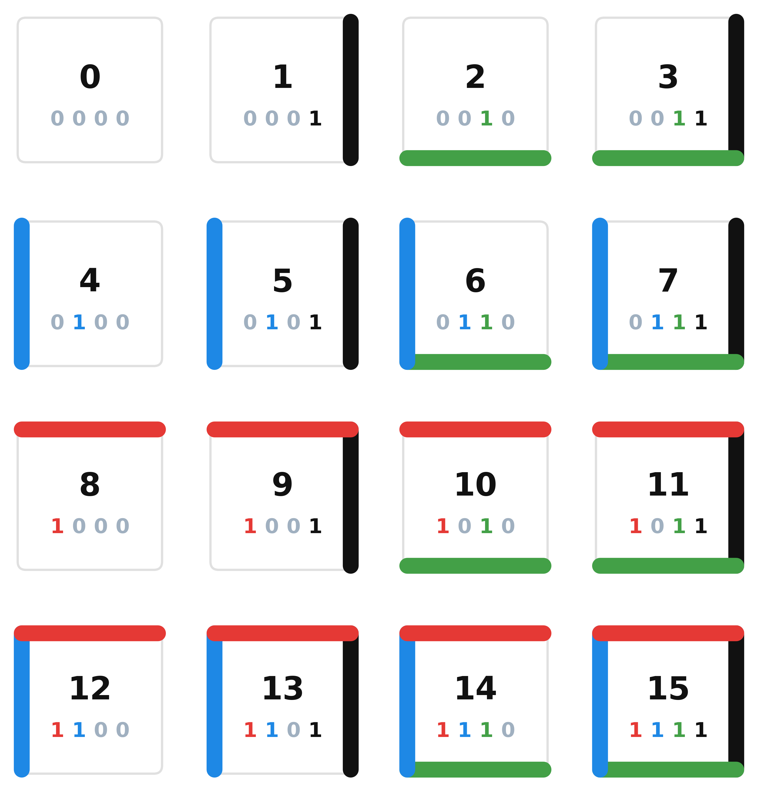

---
2. **Internal Filling (Visual Balance Diagonals):** Internal diagonals are used to balance the stroke density and optimize optical readability:

| Density Class | Active Bits | Balancing Element | Target Total Density |
| :--- | :---: | :--- | :--- |
| **Zero Density** | `0` | Two internal diagonals (`/` and `\`) | Fixed density of **2 lines** |
| **Low Density** | `1` | One internal diagonal (`/`) | Fixed density of **2 lines** |
| **Medium Density** | `2` | One internal diagonal (`/` or `\`) | Fixed density of **3 lines** |
| **High Density** | `3–4` | Completely inner-empty | Natural outer density of **3 or 4 lines** |

The entire YOalphabet is constructed from 44 total lines: 32 outer square edges and 12 internal diagonals.

  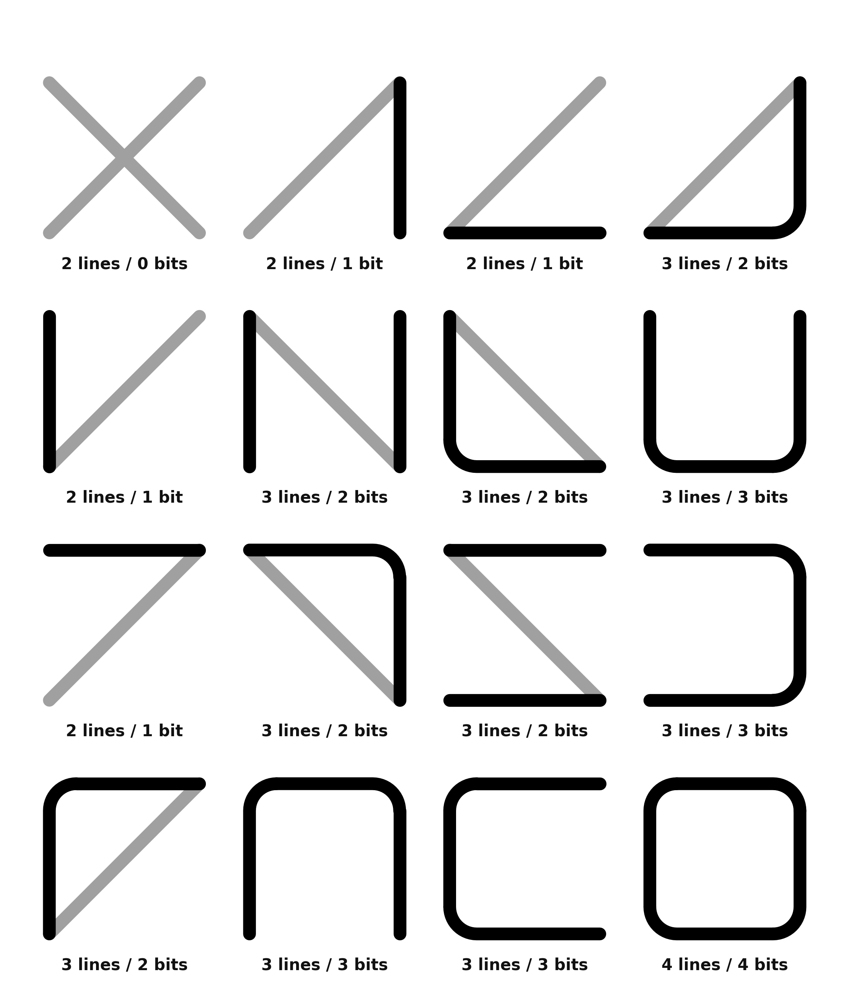

---
#### 📐 Dual Geometric Profiles: Static vs. Rotational Symmetry

By inverting the internal diagonals of just three symbols (#2, #5, and #8), we achieve complete rotational symmetry across all 1-bit characters. In this mode, a single basic corner shape rotates 90° as the active bit moves across the four edge registers (right, bottom, left, top).
Both options are fully supported and valid:
Canonical Mode: Maximizes code simplicity for bare-metal hardware decoders.
Rotational Mode: Provides perfect spatial isotropy, 2D/3D vector rotation, and animation consistency.
Both profiles remain 100% mathematically equivalent—preserving the exact 44-line budget, 4-bit register mapping, and vowel/consonant line density.

  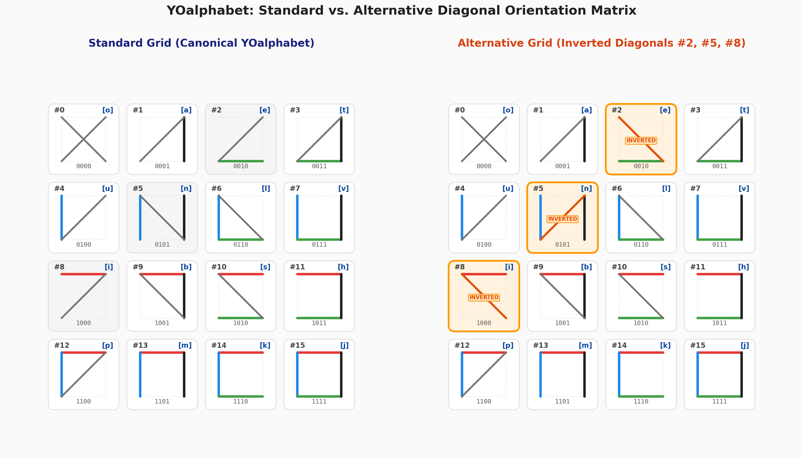

---
3. To finalize the alphabet, I selected **16 of the most common IPA sounds** across global languages:
   
* **Vowels:** `[o]`, `[a]`, `[e]`, `[u]`, `[i]`
* **Consonants:** `[t]`, `[n]`, `[l]`, `[v]`, `[b]`, `[s]`, `[h]`, `[p]`, `[m]`, `[k]`, `[j]`

By doing so, I ensured that the script remains **culturally and historically neutral**, making it instantly easy to pronounce for anyone on the planet.

  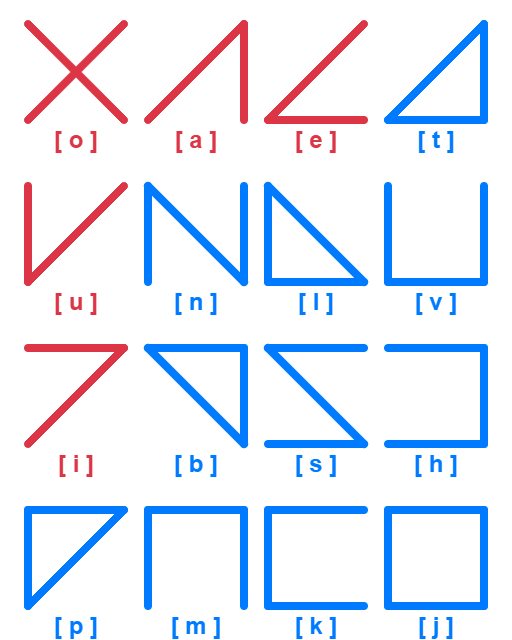

All 5 basic vowel sounds of the language (`[o]`, `[a]`, `[e]`, `[u]`, `[i]`) are encoded with **0 or 1 active bits**. 
Graphically, each consists of exactly **2 lines** (including compensatory diagonals) and features a diagonal running from the bottom-left corner.

---
4. Final

| Dec | Bin | Contour | Internal | IPA |
| :---: | :---: | :--- | :---: | :---: |
| **0** | `0000` | None | X | `[o]` |
| **1** | `0001` | Right | / | `[a]` |
| **2** | `0010` | Bottom | / | `[e]` |
| **3** | `0011` | Bottom + Right | / | `[t]` |
| **4** | `0100` | Left | / | `[u]` |
| **5** | `0101` | Left + Right | \ | `[n]` |
| **6** | `0110` | Left + Bottom | \ | `[l]` |
| **7** | `0111` | Left + Bottom + Right | None | `[v]` |
| **8** | `1000` | Top | / | `[i]` |
| **9** | `1001` | Top + Right | \ | `[b]` |
| **10** | `1010` | Top + Bottom | \ | `[s]` |
| **11** | `1011` | Top + Bottom + Right | None | `[h]` |
| **12** | `1100` | Top + Left | / | `[p]` |
| **13** | `1101` | Top + Left + Right | None | `[m]` |
| **14** | `1110` | Top + Left + Bottom | None | `[k]` |
| **15** | `1111` | Top + Left + Bottom + Right | None | `[j]` |

   

  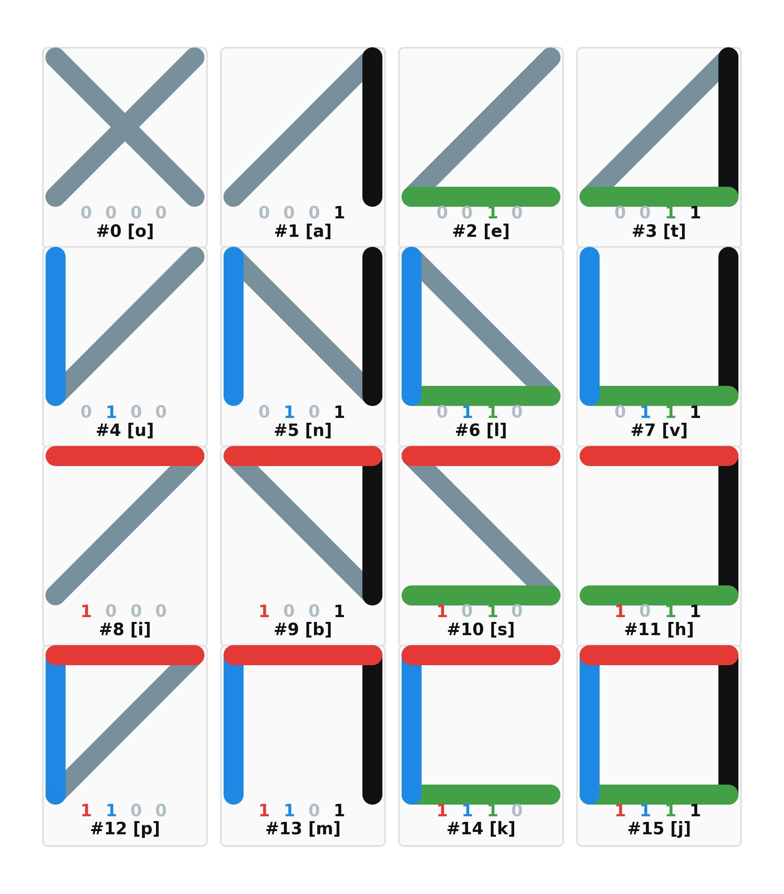

---
## 📐 Spatial Layout Specification & The 4x4 Script Passport

Every document, digital interface, or isolated text asset within the YOalphabet must conform to a strict spatial, geometric, and calibration protocol to guarantee deterministic parsing by both human eyes and computer vision systems:

### 1. The 4x4 Identity Matrix (System Passport)
On physical and digital media, the complete code table is strictly displayed as a monolithic 4x4 matrix, filling sequentially from left to right, top to bottom by increasing decimal index. 
* **Calibration Requirement:** This 4×4 master calibration marker must be permanently rendered in the top-left corner of every document or data block to serve as the system's identification and calibration passport. 
* **Promotional Asset:** This standard matrix layout also serves as the official visual identity to promote the YOalphabet.

### 2. Rigid Spatial Typography Regulations
The layout engine completely eliminates variable tracking and kerning, relying on a deterministic, isotropic matrix grid:
* **Strict Directionality:** The text flow is absolute, running exclusively from left to right and from top to bottom.
* **Isotropic Word Spacing:** A space between words is represented by an empty geometric region exactly equal to the physical bounding box of a single character.
* **Proportional Grid:** The inter-character spacing and inter-line leading must be perfectly identical, maintaining a rigid, predictable square grid across the entire canvas.

  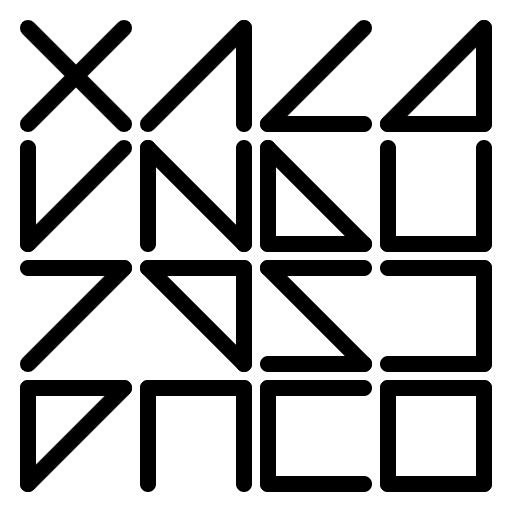

### 🎨 UI/UX & Visual Style Adaptability (Skinning Example)

While the underlying 4-bit hardware topology and mathematical matrix remain 100% invariant, the visual layer of **YOalphabet** acts as an adaptable UI/UX skin. 

Developers and UI designers can re-render the script across diverse visual themes—ranging from high-contrast HUDs and bioluminescent interfaces to retro-futuristic or cyberpunk styles—without breaking the deterministic machine readability.

  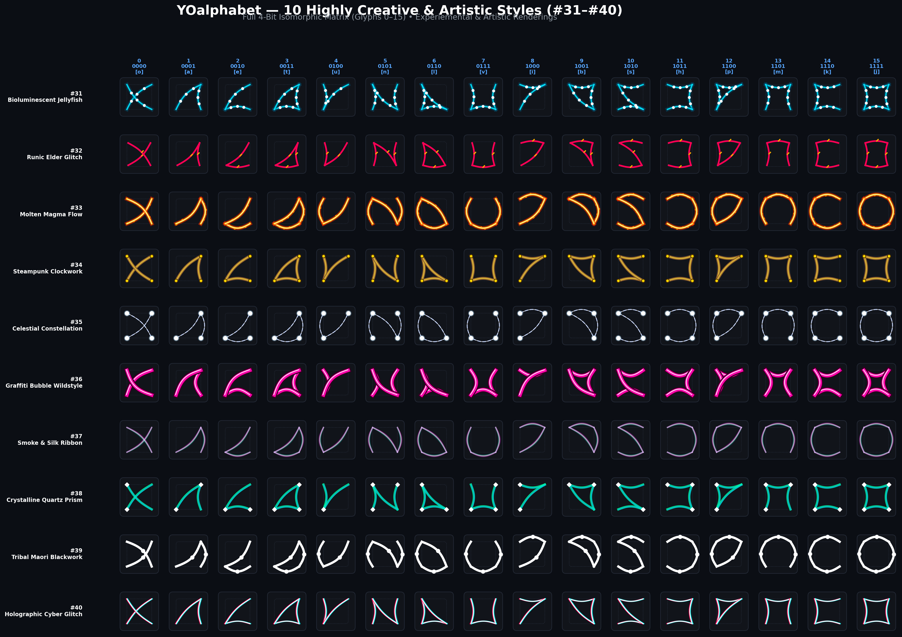
   
  <b>Figure:</b> Example of 10 distinct UI/UX visual skins applied to the same invariant 4-bit matrix (Styles #31–#40).

> **UI/UX Core Principle:** The aesthetic rendering is purely cosmetic. Whether displayed as a glowing neon HUD or a minimalist vector outline, the 4 outer edge registers ($2^0, 2^1, 2^2, 2^3$) maintain an exact, zero-overhead hardware mapping.

---

##### 🔴 Dot-Matrix & Circle-Grid Rendering (LED, Flip-Dot & Tactile Pin Arrays)

The 4-bit geometric topology of **YOalphabet** scales seamlessly into discrete, low-resolution dot-matrix hardware without losing zero-overhead register mapping. Each 4-bit glyph is mapped onto a minimalist circle-grid (dot matrix), making it natively compatible with low-cost LED matrices, flip-dot displays, e-paper micro-arrays, and physical tactile pin actuators.

  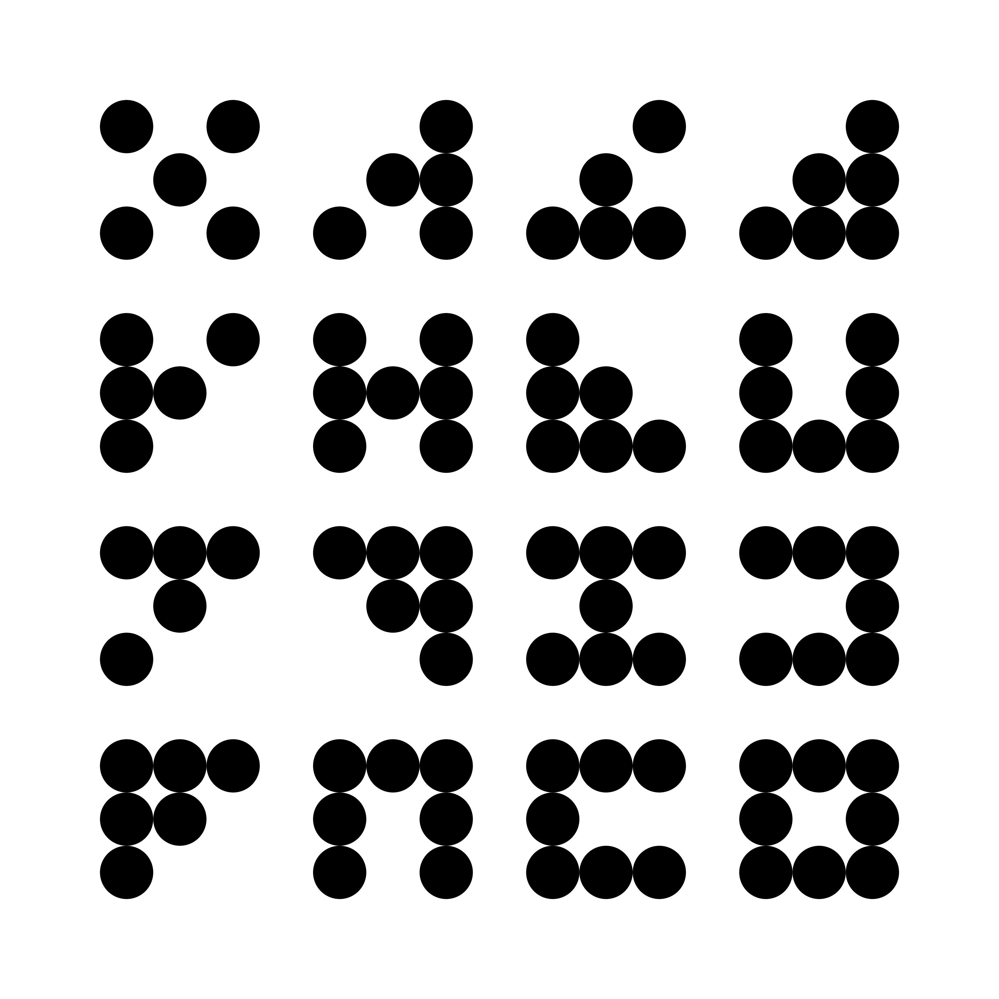
   
  <b>Figure:</b> Discrete Circle-Grid / Dot-Matrix rendering of the 16 core YOalphabet glyphs (Indices #0–#15).

* **Hardware Parity:** Directly executable on $5 \times 5$ or $7 \times 7$ LED / flip-dot driver chips with zero pixel interpolation.
* **Tactile Readability:** Provides an immediate physical bridge for micro-pin haptic displays and relief embossing.

---

### 🖐️ 4-Bit Kinetic Sign Language & Emergency Tactile Interface YOalphabet

The 4-bit full isomorphism of **YOalphabet** naturally extends beyond visual glyphs and digital displays into a **physical 4-bit sign language**. By utilizing just **two fingers on each hand**, anyone can encode and transmit the entire 16-character alphabet in real time without voice, cameras, or digital hardware [1, 2].

  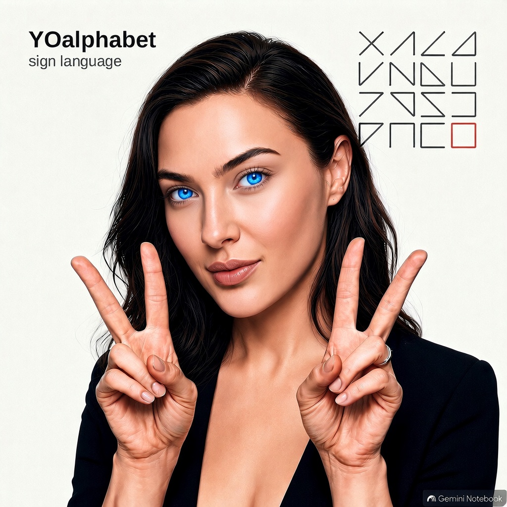
   
  <b>Figure:</b> 4-Bit Hand Gesture Mapping using 2 fingers per hand for tactile and non-verbal communication.

#### 📐 Binary Hand Mapping (2 Fingers per Hand = 1 Nibble)
* **Right Hand (Bits 0 & 1):** Controls the lower bits ($2^0 = 1$ and $2^1 = 2$).
* **Left Hand (Bits 2 & 3):** Controls the higher bits ($2^2 = 4$ and $2^3 = 8$).
* **Combined State (0000 to 1111):** 4 binary finger positions map 1-to-1 directly to the 16 decimal indices (0–15), their corresponding IPA phonetic sounds, and semantic core vectors [1, 3].

#### 🚨 Key Applications & Use Cases
1. **Deaf & Hard-of-Hearing Accessibility:** Provides an ultra-simple, 16-state tactile interface for non-verbal communication that eliminates the steep learning curve of complex natural sign language alphabets.
2. **Critical & Emergency Situations:**
   * **Zero-Noise Tactical Environments:** Silent signaling for search & rescue teams, military personnel, or security operators.
   * **Extreme Environments & Hazard Zones:** Communication through thick protective gloves, hazard suits, or behind reinforced glass where voice transmission is blocked.
   * **Medical & Post-Trauma Care:** Allows patients unable to speak (ICU, intubation, paralysis) to output precise 4-bit words and semantic requests using minimal motor activity.
3. **Low-Bandwidth Tactile Sensors:** Direct human-to-glove input for VR/AR controllers and assistive robotics.

---

### 🌐 Extended & High-Impact Application Domains

Beyond standard embedded systems and microcontroller displays, the 4-bit full isomorphism and zero-overhead hardware mapping of **YOalphabet** enable critical deployment across specialized high-impact domains:

#### 1. 📡 Deep Space & Low-Bandwidth Telemetry (SETI & Interplanetary VLF)
* **Extreme Data Compression:** In high-noise, long-distance communication (e.g., deep-space laser links or VLF channels), transmitting raw text is energy-prohibitive. A single 4-bit YOalphabet symbol simultaneously transmits a binary register, decimal index, IPA phonetic sound, and a core semantic category vector.
* **Universal Calibration:** The $4 \times 4$ calibration matrix serves as an invariant geometric probe, readable by any visual sensor or automated system without prior linguistic context.

#### 2. 🛡️ Air-Gapped SCADA & High-Security Industrial Control
* **Buffer-Overflow & Injection Immunity:** Traditional text parsing in SCADA and industrial controllers introduces security vulnerabilities. YOconlang's strict SVO syntax and bounded 4-bit domain eliminate code-injection and buffer-overflow vectors entirely.
* **Energy-Harvesting Sensors:** On passive RFID/NFC tags or ambient energy-powered IoT nodes (solar/vibration), zero-inference 4-bit register decoding operates within microjoule energy budgets.

#### 3. 🧠 Brain-Computer Interfaces (BCI) & Emergency Medical Care
* **Direct EEG Pulse Mapping:** Discrete neural spikes and Brain-Computer Interface (BCI) output states map directly into 4-bit YOalphabet registers without energy-intensive NLP processing.
* **Critical Medical Signaling:** Allows non-verbal or paralyzed patients (ICU, intubation, post-trauma) to express high-priority semantic needs using minimal motor activity or eye movements.

#### 4. 🥽 Low-Power AR/VR & HUD Systems
* **Zero-Latency Edge Vision:** Micro-displays and smart glasses decode YOalphabet symbols instantly via basic pixel-edge checks without running heavy neural OCR pipelines, preserving battery life and reducing thermal overhead.

#### 5. 🔍 Optical Watermarking & Anti-Counterfeiting
* **Steganographic Micro-Marking:** 4-bit square frames can be subtly integrated into PCB layers, microchip packaging, or physical goods, enabling instant hardware authentication via a simple 4-point luminosity check.

#### 6. 🎮 Interactive Sci-Fi Universes & Functional Gaming Lore
* **Deterministic In-Game Bytecode:** Serves as a fully functional, mathematically real language protocol for cyberpunk HUDs, sci-fi games, and worldbuilding—readable by both human players and in-game AI logic engines.

---
##   Adaptation of YOalphabet to the American (English) Alphabet

To extend the baseline **YOalphabet** (16 core glyphs) to the full 26-letter American alphabet while preserving its compact 4-bit geometric architecture, a **two-register system** is implemented [1]:

* **Register 1 (Base):** The 16 original letters encoded by clean geometric glyphs. Accounts for **~82%** of letter frequency in standard English.
* **Register 2 (Modified):** The 10 remaining letters encoded using Register 1 donor glyphs with an **internal diacritic dot** placed inside the bounding box. Accounts for **~18%** of letter occurrences in standard English.

  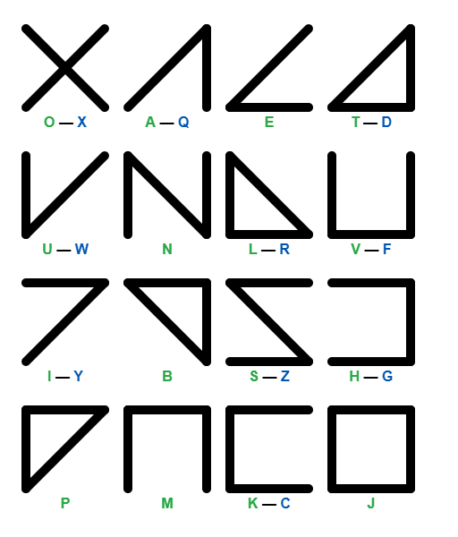

### 📊 Two-Register Mapping Matrix

| Donor Glyph | Register 1 (Base) | Register 2 (+ Internal Dot) | Pair Type | Phonetic / Graphic Rationale |
| :---: | :---: | :---: | :---: | :--- |
| **[o]** | **O** | **X** | Graphic | Visual shape match (X-cross inside bounding box). |
| **[a]** | **A** | **Q** | Phonetic | *QU* (/kw/) combination linked to open back vowel **A**. |
| **[e]** | **E** | | — | — |
| **[t]** | **T** | **D** | Phonetic | Voiced pair for unvoiced stop /t/. |
| **[u]** | **U** | **W** | Phonetic | Labialized pair: vowel /u/ transitions to semivowel /w/. |
| **[n]** | **N** | | — | — |
| **[l]** | **L** | **R** | Phonetic | Pair of liquid sonorants (/l/ and /r/). |
| **[v]** | **V** | **F** | Phonetic | Unvoiced pair for voiced fricative /v/. |
| **[i]** | **I** | **Y** | Phonetic | Vowel pair: Y reads as /i/ in most English syllables. |
| **[b]** | **B** | | — | — |
| **[s]** | **S** | **Z** | Phonetic | Voiced pair for unvoiced fricative /s/. |
| **[h]** | **H** | **G** | Phonetic | Velar/glottal pair (shared place of articulation). |
| **[p]** | **P** | | — | — |
| **[m]** | **M** | | — | — |
| **[k]** | **K** | **C** | Phonetic | Hard /k/ sound mapped to letter **C**. |
| **[j]** | **J** | | — | — |

---

### 🖐️ Tactile & Braille Interface YOalphabet

The 4-bit full isomorphism of **YOalphabet** extends naturally beyond visual rendering and computer vision into a high-efficiency tactile writing system. **YOalphabet** is designed for refreshable Braille displays, micro-relief paper embossing, tactile packaging markers, and haptic feedback devices.

Unlike legacy 6-dot or 8-dot Braille systems that require arbitrary memorization of non-isomorphic patterns, **YOalphabet** maintains a direct 1-to-1 physical mapping between raised tactile points, binary hardware registers, and universal IPA phonetic sounds.

  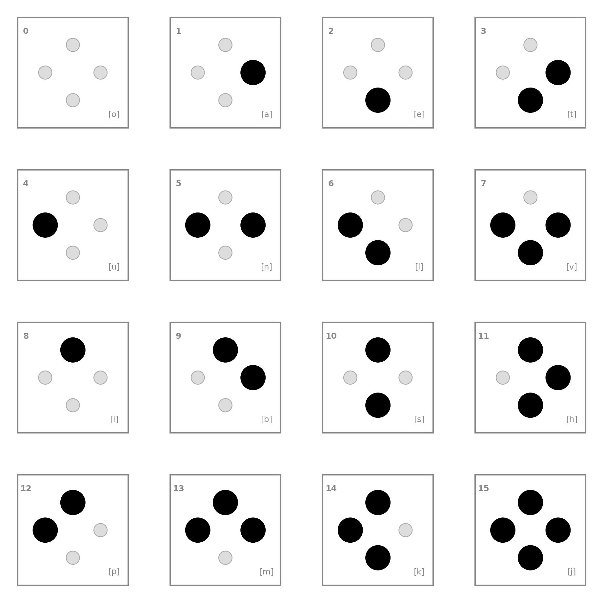
  &nbsp;&nbsp;&nbsp;&nbsp;
  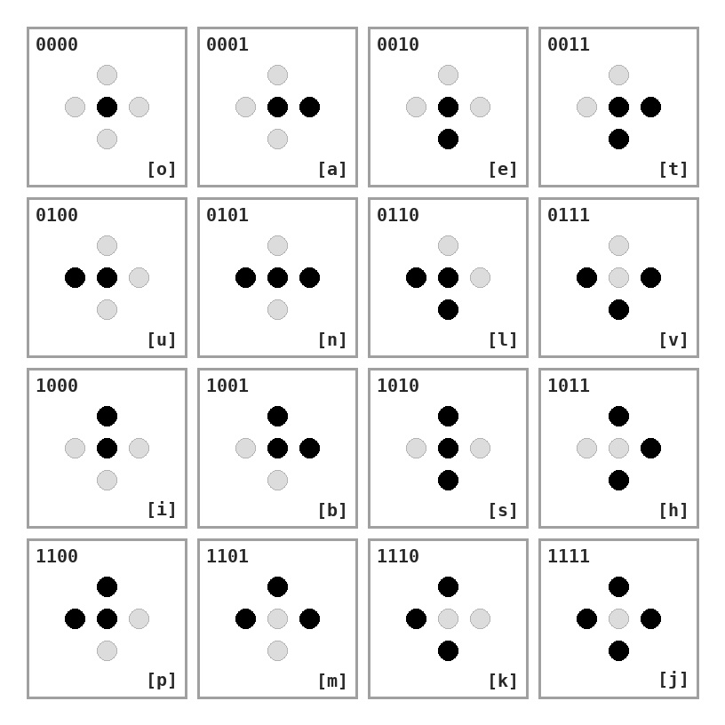

  <b>Figure:</b> Standard 4-Dot Pure Binary Matrix (Left) vs. Self-Anchoring 5-Dot Matrix with Central Reference Point (Right).

#### 🔄 Architecture Comparison: 4-Dot vs. 5-Dot Matrix

##### 1. Pure 4-Dot Matrix 
* **Structure:** Minimalist 4-point diamond layout (Top, Right, Bottom, Left).
* **Zero Symbol (`0000` / `[o]`):** Rendered as an empty cell (0 raised dots).
* **Best Used For:** Refreshable digital Braille displays, haptic arrays with fixed physical cell frames, and high-density micro-embossing.

##### 2. Self-Anchoring 5-Dot Matrix 
* **Structure:** 4-point diamond layout + **1 Permanent Center Anchor Dot**.
* **Zero Symbol (`0000` / `[o]`):** Rendered with **only the center dot raised**.
* **Tactile Ergonomics:** The central anchor acts as an instantaneous spatial reference. When sweeping fingertips across embossed paper, the reader immediately locates the cell center without needing external physical bounding boxes or grid lines.
* **Best Used For:** Embossed paper, packaging, tactile signage, and blind reading in rimless environments.

---

[-Follow%20%40YOalphabet-1DA1F2?style=for-the-badge&logo=x&logoColor=white)](https://x.com/YOalphabet)

---
## PART 2: YOconlang CORE SPECIFICATION## Core Architecture and Word Immutability
YOconlang is an a priori engineered language optimized for unambiguous, frictionless communication. A foundational axiom of the language is the absolute immutability of roots. There are no inflections, suffixes, declensions, or internal conjugations. Grammatical categories, temporal shifts, and modalities are expressed exclusively via external grammatical particles.
The phonotactics are strictly anchored in the International Phonetic Alphabet (IPA), using 5 core vowels and 11 stable consonants to eliminate all articulatory barriers. Stress is fixed invariantly on the first syllable of every separate word.

The entire semantic and structural architecture of YOconlang is engineered strictly in accordance with the **MECE (Mutually Exclusive, Collectively Exhaustive)** principle. Every root, grammatical category, and operational mode occupies a unique, non-overlapping coordinate in the semantic space, ensuring zero ambiguity, while the matrix completely covers the entire spectrum of objective and subjective reality without systemic gaps. All future lexical expansions and core developments will strictly maintain this MECE framework.

  <strong>Binary Code ⟺ Decimal Index ⟺ Spatial Geometry ⟺ IPA Phoneme ⟺ MECE Ontological Core ⟺ Human-AI Interface</strong>

The language utilizes strict morphological word templates:

* Verbs, Adjectives, Adverbs: Rigid three-letter roots following the C₁VC₂ structure.
* Nouns: Rigid four-letter roots following the C₁V₁C₂V₂ structure.
* Pronouns and Structural Particles: Two-letter combinations following VC or CV templates.

### Current development status YOconlang
  
| Pattern / Structure Type | Total Possible | Occupied | Free | Comments and Status |
| :--- | :---: | :---: | :---: | :--- |
| **VV** | 25 | 25 | 0 | System markers. |
| **CV** | 55 | 55 | 0 | Relational markers and basic numbers. |
| **VC** | 55 | 55 | 0 | Pronominal quantifiers. |
| **CVC** | 605 | 605 | 0 | Verbs, adverbs, and adjectives. |
| **CVV** | 275 | 0 | 275 | Reserve zone. |
| **CCV** | 605 | 0 | 605 | Reserve zone. |
| **VVC** | 275 | 0 | 275 | Reserve zone. |
| **VCV** | 275 | 0 | 275 | Reserve zone. |
| **VCC** | 605 | 0 | 605 | Reserve zone. |
| **All 4-character combinations** | 65,536 | 3,025 | 62,511 | Only the noun class is occupied. |
| **All 5-character combinations** | 1,048,576 | 0 | 1,048,576 | Reserve zone. |

> 📂 **Implementation Note:** The complete, exhaustive listings and coordinate maps for the **VV** (System Markers), **CV** (Relational Particles), **VC** (Pronominal Quantifiers), and the **Numeric Blocks** have been extracted into standalone, production-ready specification files located directly in the root of this repository for clean modular access.

  

## Strict SVO Word Order and Linear Syntax
The language enforces a rigid, unalterable linear SVO (Subject — Verb — Object) word order. Any form of inversion, omission, or displacement of components is strictly forbidden. 
Since the core roots are completely uninflected, grammatical and syntactic roles are determined solely by their fixed geometric position within the sentence flow.

## The Semantic Core Matrix (The YOconlang Kernel)

  

All lexical meanings and roots are generated systematically through a 3-axis orthogonal matrix based on the Core Kernel.

## Axis 1: C₁ — Domain of Origin (Source Environment)

* L — Space / Physical Geometry: Coordinates, three-dimensional volume, distance, location.
* T — Time / Chronology: Chronological scale, duration of processes, phases, natural cycles.
* P — Inanimate Matter: Substances, inorganic materials, artificial objects, tools.
* B — Energy and Forces: Physical phenomena, vectors, directional energy fields.
* S — Biosphere and Life: Organic carbon life, flora, fauna, tissues, cells, human physical body.
* N — Psyche and Will: Internal mental world, consciousness, emotions, intent, focus of attention.
* V — Primary Perception / Sensory: Raw incoming signals of sense organs before logical analysis.
* M — Language and Coding / Semiotics: Interfaces and means of transmitting meaning — signs, tokens, words, syntax.
* K — Data and Memory / Statics: Fixed archived information, datasets, blocks of knowledge, files.
* H — Thinking and Algorithms / Dynamics: Data processing, logical analysis, computations, runtime code.
* J — Social sphere: Family, communities, social hierarchies, institutions, economy, network graphs.

## Axis 2: V₁ — Process Vector (Operational Mode)

* O — Statics / Being: State of rest, parameter locking, preservation of status quo, immutability.
* A — Action / Modification: Active change, generation of a new quality, assembly, creation, work.
* U — Counteraction / Destruction: Quality degradation, entropy, structural breakdown, deletion.
* E — Import / Perception (Input): Inbound system flow, absorption of external environment, data reading.
* I — Export / Expression (Output): Outbound system flow, emission of energy, data writing, transmission.

## Axis 3: C₂ — Target Node of Impact (Objective Destination)
The C₂ consonant maps symmetrically to the exact type of destination entity or environment being impacted by the vector flow:

* L — Location / Point: Final spatial target, physical landmark, memory coordinate address.
* T — Term / Event: Fixed time interval, deadline, timestamp, chronological phase.
* P — Object / Instrument: Inanimate material thing, tool, raw physical substance.
* B — Element / Directed Force: Directional wave, physical impulse, pressure vector.
* S — Bio-object / Organism: Living individual, biological structure, human body node.
* N — Personality / Mental State: Individual consciousness, cognitive target, focus trigger, belief.
* V — Primary Sensation: Raw sensory stimulus, physical receptor excitation.
* M — Word / Concept: Explicit linguistic token, entity name, interface identifier, label.
* K — Message / Text: Connected block of information, letter, archived dataset, code line.
* H — Rule / Algorithm: Explicit code, legal or moral norm, regulation, mathematical calculation.
* J — Collective / Network Graph: Social group, community, structured network of human or system relations.
----------------------------------------------------------------------------------------------------------

  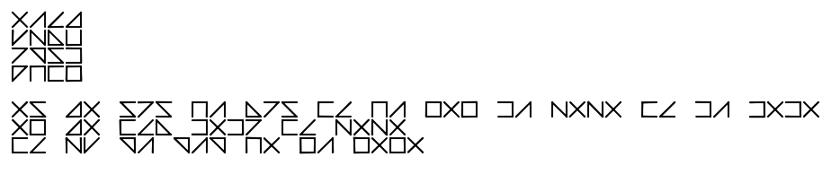

   YOconlang Translation Specification: Universal Declaration of Human Rights (Article 1) 
    This section provides a complete, granular, word-by-word morphemic breakdown and phonetical transcription 
    of the First Article of the Universal Declaration of Human Rights translated into YOconlang. 
    The translation strictly adheres to the unchangeable root axiom, SVO linear syntax,
    and fixed first-syllable stress phonotactics.

## 📄 Sentence 1: On Birth, Freedom, and Equality of All Human Beings

* Original (American English): "All human beings are born free and equal in dignity and rights."
* YOconlang Orthography: OS TO SIS MA LIS KE MA JOJ HA NONO KE HA HOHO.
* IPA Phonetic Transcription: [ˈos ˈto ˈsis ˈma ˈlis ˈke ˈma ˈjoj ˈha ˈno.no ˈke ˈha ˈho.ho]

## 🔍 Word-by-Word Breakdown:

* OS — [os] : Universality pronoun from the approved Block O. Semantics: "All people / All human beings". Functions as the syntactic Subject (S).
* TO — [to] : Grammatical tense particle from Block T. Marks the past perfective tense (Preterite).
* SIS — [sis] : Immutable verbal root from Block 5 (Biosphere & Life). Core semantics: "To release new living organisms outward / To give birth / To reproduce" (Mode I — Outbound/Output Flow).
* MA — [ma] : Functional grammatical marker from Block 8 (Semiotics) that transforms the subsequent root into the Adjective class.
* LIS — [lis] : Immutable three-letter root from Block 1 (Space). Acts as an adjective due to the preceding MA marker. Core semantics: "To release a living organism outside / To liberate the physical body / To grant freedom" (Mode I — Outbound Flow). MA LIS translates directly to "free".
* KE — [ke] : Logical conjunction operator "AND" from Block 9 (Data & Memory).
* MA — [ma] : Repeated functional adjective marker preceding the second quality.
* JOJ — [joj] : Immutable three-letter root from Block 11 (Sociosphere) acting as an adjective. Core semantics: "To preserve an internal network of connections / To be identical to oneself / Equal in status" (Mode O — Statics/Parity). MA JOJ translates directly to "equal".
* HA — [ha] : Procedural operator particle meaning "Regarding / Concerning / In relation to" from Block 10 (Logic). Defines the semantic scope or plane where the qualities manifest.
* NONO — [ˈno.no] : Four-letter Noun structured as C₁V₁C₂V₂. Derived from the mental root NON (self-reflection, tranquility of mind, consciousness) and the final functional vowel O (Substance/Rest). Semantics: "Personal dignity / The inner mental 'Self' of a subject".
* KE — [ke] : Logical conjunction operator "AND".
* HA — [ha] : Repeated procedural operator particle "Regarding / In relation to".
* HOHO — [ˈho.ho] : Four-letter Noun structured as C₁V₁C₂V₂. Derived from the logical root HOH (to execute a pure algorithm) and the final functional vowel O (Substance). Semantics: "Abstract law / Legal right / Unalterable systemic norm".

------------------------------
## 📄 Sentence 2: On Endowment with Reason and Conscience

* Original (American English): "They are endowed with reason and conscience"
* YOconlang Orthography: OJ TO KEL HOHI KE NONO.
* IPA Phonetic Transcription: [ˈoj ˈto ˈkel ˈho.hi ˈke ˈno.no]

## 🔍 Word-by-Word Breakdown:

* OJ — [oj] : Collective universality pronoun from Block O. Semantics: "The entire society / They as a collective group / Human collective". Functions as the syntactic Subject (S) in the SVO structure.
* TO — [to] : Past tense particle (Preterite). Verifies the historical fact of being endowed.
* KEL — [kel] : Immutable verbal root from Block 9 (Data & Memory). Core semantics: "To receive external texts / To import data archives / To absorb and capture information at the circuit input" (Mode E — Import/Input). Syntactically maps to "to receive / to absorb / to be endowed with".
* HOHI — [ˈho.hi] : Four-letter Noun structured as C₁V₁C₂V₂. Derived from the root HOH (logic) and the final functional vowel I (Projection/Output). Semantics: "The processed outbound logical output of computations / Intellect / Reason". Functions as the primary direct Object (O₁).
* KE — [ke] : Logical conjunction operator "AND".
* NONO — [ˈno.no] : Four-letter Noun structured as C₁V₁C₂V₂ (Root NON + Vowel O). Semantics within this specific syntactic position: "Internal moral peace of mind / Moral self-awareness / Conscience". Functions as the secondary direct Object (O₂).

------------------------------
## 📄 Sentence 3: On the Obligation to Act in a Spirit of Brotherhood

* Original (American English): "and should act towards one another in a spirit of brotherhood."
* YOconlang Orthography: KE NU BA BAB MO JA JOJO.
* IPA Phonetic Transcription: [ˈke ˈnu ˈba ˈbab ˈmo ˈja ˈjo.jo]

## 🔍 Word-by-Word Breakdown:

* KE — [ke] : Logical conjunction operator "AND", initiating a new coordinate clause in the speech stream.
* NU — [nu] : Modal particle of absolute duty and rigid obligation from Block 6 (Psychology). Semantics: "Must / Should / Is obliged to" (modifies the subsequent action).
* BA — [ba] : Reciprocal voice particle from Block 4 (Energy & Forces). Directs the subsequent kinetic impulse of the verb symmetrically towards each participant ("mutually / towards one another").
* BAB — [bab] : Immutable verbal root from Block 4 (Energy & Forces). Core semantics: "To modify a physical or systemic impulse / To direct a stream of force / To act / To exert influence" (Mode A — Action). NU BA BAB translates directly to "are obliged to mutually act".
* MO — [mo] : Functional grammatical marker from Block 8 (Semiotics) that transforms the subsequent root into the Adverb class.
* JA — [ja] : Immutable three-letter root from Block 11 (Sociosphere) acting as an adverb due to the MO marker. Core semantics: "To direct an action for the benefit of the collective / solidarily" (Mode A — Social System Target). MO JA translates to "collectively / solidarily / in a spirit of cooperation".
* JOJO — [ˈjo.jo] : Four-letter Noun structured as C₁V₁C₂V₂. Derived from the root JOJ (preservation of an internal network of connections) and the final functional vowel O (Substance/Rest). Semantics: "An unbreakable, stable internal network of collective ties / Family / Community / Brotherhood".

------------------------------
## 🎼 Complete Monolithic Phonetic Stream
The complete unbroken stream of text is ready for phonetic compilation and synthesis:
[ˈos ˈto ˈsis ˈma ˈlis ˈke ˈma ˈjoj ˈha ˈno.no ˈke ˈha ˈho.ho ˈoj ˈto ˈkel ˈho.hi ˈke ˈno.no ˈke ˈnu ˈba ˈbab ˈmo ˈja ˈjo.jo]
## 🛠 Syntax & Phonotactic Compliance Notes:

   1. All word order arrays are strictly restricted to the linear SVO framework.
   2. Phonetic reduction or vowel slurring is completely absent (0%).
   3. Stress assignment is invariantly locked onto the first syllable of every single word unit.

----------------------------------------------------------------------------------------------------------------------------------------------------------------------------------------

### 🛠️ Practical High-Impact Applications

#### 🌐 1. Specialized Communication Channels & Low-Bandwidth Infrastructure
* **Subsea & Deep Space Sub-channels:** Ideal for Very Low Frequency (VLF) acoustic modems or long-range deep-space nodes where transmission is capped at single bits per minute.
* **Extreme Degraded Networks (LoRaWAN & Mesh):** Eliminates heavy string payloads. A single byte transmits two fully formed, phonetically rich semantic roots, bypassing the need for transport-layer text compression.
* **Emergency Quantum & Laser Dispersal:** The 4-bit binary matrix provides a zero-overhead error-correction baseline for Free-Space Optical (FSO) or post-quantum cryptographic telemetry.

#### 🧠 2. Human-Machine & Bio-Digital Interfaces (HCI / BCI)
* **Inclusive Human-Hardware (Assistive Tech):** The high-contrast, self-balancing grid enables tactical and tactile character recognition for the visually impaired that is vastly superior to complex, non-isomorphic Braille layouts.
* **Direct Neural Encoding (BCI / EEG):** The 4-bit register-level architecture mirrors discrete neural firing patterns, allowing brain-computer interfaces to read, parse, and synthesize text directly without resource-heavy NLP model translation.
* **Augmented Reality (AR) Heads-Up Displays:** Optimized for low-resolution, high-glare smart glasses. The strict geometric contours ensure instantaneous edge-detection rendering by low-power wearable chips.

#### 🔋 3. Data Green-Computing & Edge IoT Swarms
* **Hardware-Level Register Strings:** Direct execution on 8-bit or 16-bit microcontrollers within autonomous Machine-to-Machine (M2M) IoT swarms, fully bypassing application layers and reducing data center cooling and power footprints.
* **Energy-Harvesting Edge Devices:** Operates efficiently on passive RFID/NFC or solar-powered sensors, executing semantic logic at the bare hardware level before the power cycle depletes.

#### 🤖 4. Autonomous Systems & Resilient Infrastructure
* **Swarm Robotics & Kinetic Coordination:** Drone networks can exchange uncompressed, structural SVO command vectors (`Subject-Verb-Object`) in real-time using raw 4-bit physical registers for collision avoidance and target alignment.
* **Air-Gapped Industrial Automation:** Provides an isolated, predictable, human-readable yet machine-executable instruction script for SCADA systems, preventing buffer overflow exploits and remote code execution vulnerabilities.

## 🎯 Key Architectural Advantages (Core Thesis)

* **💻 Full Isomorphism Chain** — Every data token is an unbreakable, bijective (one-to-one) link bridging raw hardware registers directly to cognitive semantic structures: `Binary Code ⟺ Decimal Index ⟺ Spatial Geometry ⟺ IPA Phoneme ⟺ MECE Ontological Core ⟺ Human-AI Interface`.
* **📐 Zero Mapping Abstraction** — The visual structure is not drawn arbitrarily; it is mathematically generated by a strict deterministic formula based on spatial bit-register weights.
* **📊 Strict MECE Compliance & Future Proofing** — The conceptual kernel and grammatical partitions are designed mathematically to be Mutually Exclusive and Collectively Exhaustive. This guarantees that no semantic collisions or overlapping definitions can occur, providing a hallucination-free foundation for LLMs and autonomous systems.
* **🔢 Hardware-Level Alphanumerics** — Glyphs do not merely represent numbers—they *are* the numbers. The decimal value $D$ physically dictates and renders the contour geometry.
* **🗣️ Line-Density Phonetic Classification** — The system acts as a built-in feature extractor: all vowels are mathematically restricted to exactly 2 lines, while consonants strictly require 3 or more lines.
* **👁️ Edge Computer Vision Optimization** — Recognition pipelines bypass heavy Convolutional Neural Networks (CNNs). Low-power microcontrollers can parse the 4-bit byte instantly via raw pixel-intensity checks on 4 fixed coordinates.
* **🤖 Direct LLM/AI Processing (No Embeddings)** — AI agents and large language models can ingest, parse, and compile YOconlang streams directly into 4-bit hardware registers, completely bypassing resource-heavy token-to-vector embeddings and vector database lookups.
* **🏁 Rigid Spatial Typography Regulations** — The layout engine completely eliminates tracking and variable kerning, relying on a deterministic, isotropic matrix grid initiated by a mandatory 4×4 master calibration marker.
---

[-Follow%20%40YOalphabet-1DA1F2?style=for-the-badge&logo=x&logoColor=white)](https://x.com/YOalphabet)

---
## 💎 Thank you for your support the YOalphabet&YOconlang development via cryptocurrency. Now 0$.

* **USDT ( TRC-20):** `TFwggRZUB9BBNHwyXgZBGkd2EycSz9umGJ`
* **USDT / USDC / ETH (ERC-20):** `0x1102BbE0c8aeF5D2e44059fb951671CfC2047255`
* **TON / NOT (TON):** `UQAaXGP24eJgyfbdLC2j5R5lOicvSSPo8PGJIEnJvxjQxAsc`
---

**License:** MIT License. Fork, experiment, and build the future of unified computing communication!
